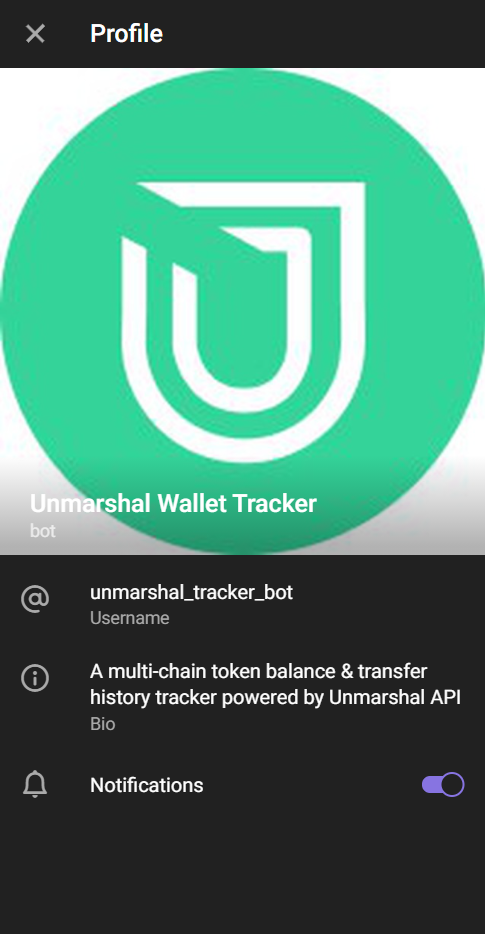
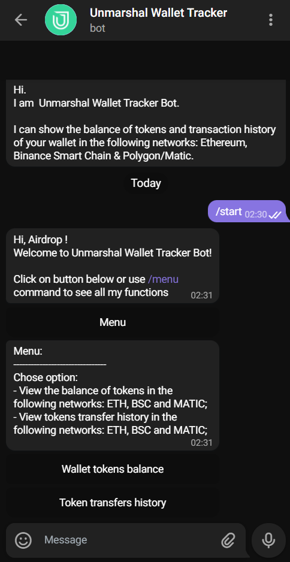
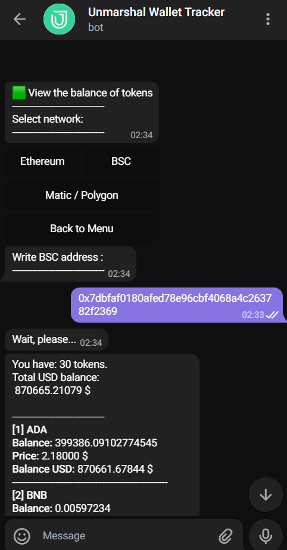
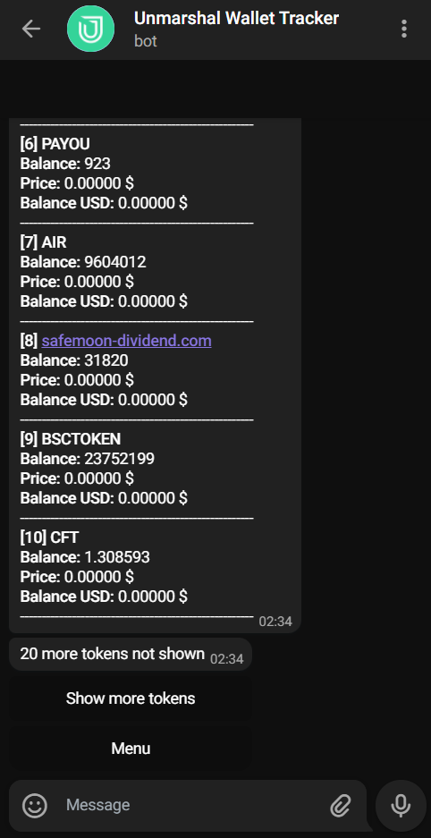
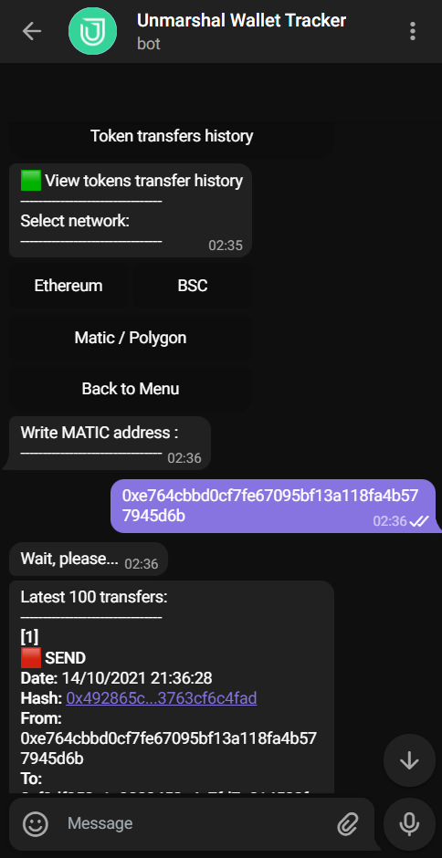
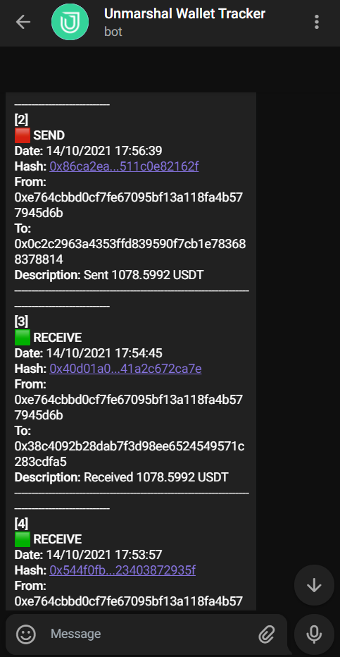

  

    
  

<h3 align="center">🚀 <u>Unmarshal Wallet Tracker Telegram Bot</u></h3>
    
A multi-chain token balance & transfer history tracker telegram bot.

  

    <i>Powered by <a target="_blank" href="https://docs.unmarshal.io/">Unmarshal API</a></i>
  

## Features:

- **Multi-chain** token balance tracker [<em>currently Ethereum Mainnet, Binance Smart Chain are Polygon/Matic chains are available</em>];
- Ability to view the tokens transfer history;

-------

## How to use / How to create this bot:

1. You need to have `Node.js` version >=`12.x`:
2. `git clone https://github.com/keyllli223/unmarshal-api-tgbot.git`
3. `cd unmarshal-api-tgbot`
4. `npm init`
5. `npm install --save request`
6. `npm install --save request-promise`
7. `npm install axios`
8. `npm install --save node-telegram-bot-api`
9. Install `pm2` for run script 24/7 in background: `npm install pm2 -g`
10. Insert in `settings.js` file your `TG_TOKEN` and `UNMARSHAL_API_KEY`
11. Run bot `pm2 start index.js`

----------

----------

## Screens:

  <table>
  <tr>
    <td></td>
    <td></td>
    <td></td>
  </tr>
  <tr>
    <td></td>
    <td></td>
    <td></td>
  </tr>
</table>
